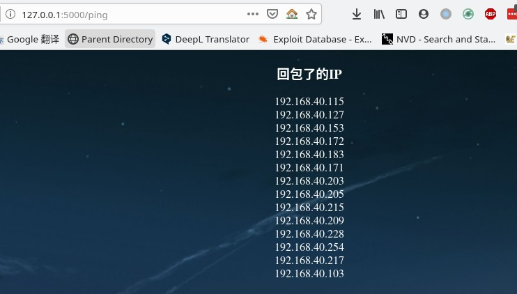

# code_practice
存放个人练习和打靶机时写的代码(各种杂七杂八的东西)

- [brainpan-1](https://www.vulnhub.com/entry/brainpan-1,51/) 缓冲区溢出的靶机
- tools/pattern.py 模仿msf的pattern_create.rb 和 pattern_offest.rb的脚本

## web-flask的演示

### 首页

### whois查询

### ping功能
